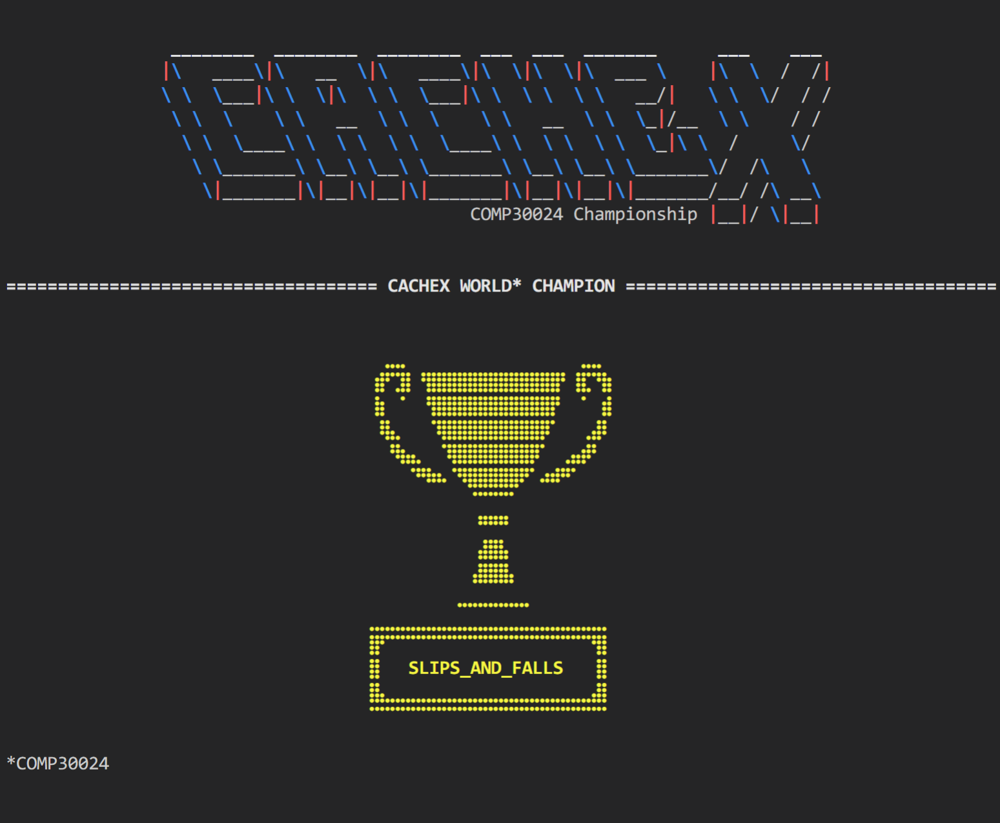

# Champion Cachex Agent
## A game playing agent for 'Cachex', a variant of 'Hex'

This project was completed as part of the subject `AI` (COMP30024). 128 teams
of 2 submitted an agent to the tournament, and this was the winner!

Our approach was based on Negamax, with several optimisations to reduce the 
search space and prune the Negamax-tree, including transposition tables using
Zobrist hash keys. See `report.pdf` for our full process.
